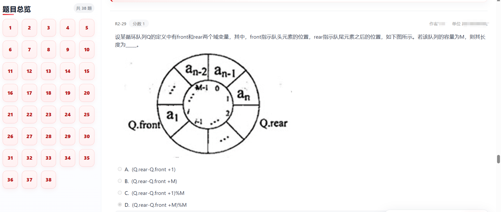
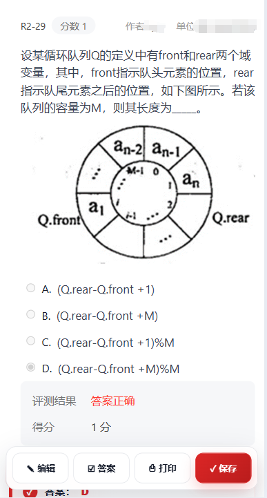
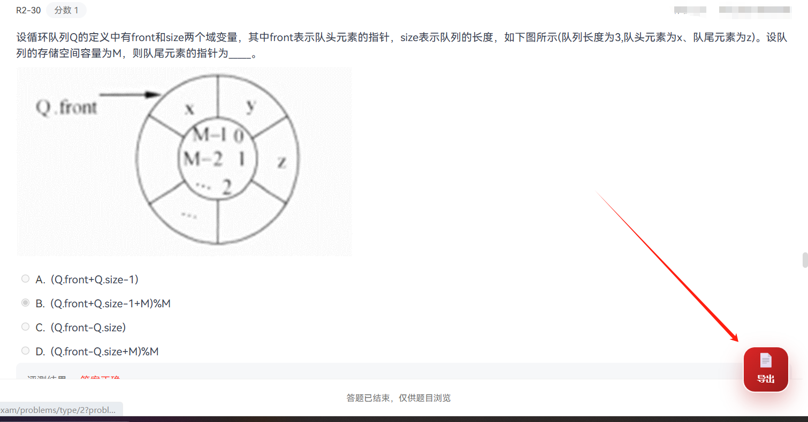

# PTA HTML Exporter

一个用于 PTA / Pintia 平台的浏览器用户脚本，可以将当前题目页面导出为**可编辑、可跳转、可打印、可离线保存的 HTML 文件**。

相比传统的 `.txt` / `.doc` 导出方式，本项目更注重保留原页面结构、题目样式、选项状态、代码块、图片链接和左侧题号导航，适合个人复习、错题整理、资料备份和离线查看。

> 本项目仅用于学习备份、错题整理和离线复习。  
> 导出的 HTML 文件中的编辑和答案修改只作用于本地文件，不会提交到 PTA，也不会影响官方成绩。

---

## 效果预览

### 桌面端效果



### 手机端效果



### 导出入口



---

## 功能特性

- 导出 PTA 当前页面中的真实题目块
- 保留题目原始 HTML 结构
- 保留选项、答案状态、代码块、图片和链接
- 自动生成题号导航栏
- 支持题号快速跳转
- 支持本地编辑题目内容
- 支持重新选择答案并同步答案块
- 支持隐藏 / 显示答案
- 支持打印导出的 HTML
- 支持保存修改后的 HTML
- 支持手机和平板自适应显示
- 无后端、无依赖、无需登录额外服务
- 所有导出操作均在浏览器本地完成

---

## 项目特点

### 保留图片和页面结构

很多导出工具只支持导出纯文本或简单文档格式，遇到图片、代码块、复杂排版时容易丢失内容。

本项目采用 HTML 原样导出的方式，尽量保留 PTA 页面中的：

- 题目正文
- 选项区域
- 代码块
- 图片资源
- 超链接
- 页面样式
- 答案状态
- 评测信息

因此更适合包含图片、表格、代码和复杂排版的题目。

---

## 适用场景

- 期末复习前备份 PTA 题目
- 整理个人错题本
- 将题目保存到本地离线查看
- 打印题目作为纸质复习资料
- 助教或班委整理课程练习资料
- 老师整理课堂讲义或题目备份
- 在手机、平板上查看导出的题目

---

## 安装方式

### 方式一：通过 Tampermonkey 安装

1. 安装浏览器扩展 Tampermonkey
2. 新建用户脚本
3. 删除默认内容
4. 粘贴本项目中的脚本代码
5. 保存脚本
6. 打开 PTA 对应题目页面
7. 页面右下角出现“导出”按钮即代表加载成功

---

## 支持页面

当前匹配规则：

```js
// @match https://pintia.cn/problem-sets/*/exam/problems/*
```

适用于：

```text
https://pintia.cn/problem-sets/xxx/exam/problems/xxx
```

---

## 使用方法

1. 打开 PTA 题目页面
2. 等待题目内容加载完成
3. 点击页面右下角的“导出”按钮
4. 点击“导出可编辑 HTML”
5. 浏览器会自动下载一个 `.html` 文件
6. 使用浏览器打开即可离线查看

---

## 移动端适配

从 `14.7.0` 版本开始支持手机和平板适配。

### 桌面端

左侧题号导航 + 右侧题目内容

### 手机端

顶部题号导航 + 下方题目内容

---

## 隐私说明

脚本本身：

- 不上传题目内容
- 不上传答案内容
- 不读取账号密码
- 不请求外部 API
- 不向第三方服务器发送数据
- 不依赖后端服务
- 导出文件完全在浏览器本地生成

权限：

```js
// @grant none
```

---

## 关于图片保存

目前：

- 保留图片绝对地址
- 保证在线可显示
- 设置懒加载

未来计划：

- 图片 Base64 内嵌
- 单文件完整离线保存

---

## 常见问题

### 为什么图片有时无法显示？

因为当前保留的是图片链接，而不是嵌入图片文件。

---

### 修改 HTML 会影响 PTA 成绩吗？

不会。

所有修改仅作用于本地文件。

---

## 版本记录

### v14.7.0

- 优化手机和平板显示
- 小屏幕下改为顶部导航
- 优化图片、表格、代码块显示

### v14.6.3

- 支持导出真实题目块
- 支持题号跳转
- 支持本地编辑
- 支持保存修改后的 HTML

---

## 开发计划

- 图片 Base64 内嵌
- 完整单文件离线模式
- 批量导出
- 导出 Markdown
- 导出 PDF
- 暗色模式
- 自定义主题
- 题目搜索

---

## 贡献

欢迎提交 Issue 和 Pull Request。

反馈建议附带：

- 浏览器版本
- 脚本管理器版本
- 页面截图
- 控制台报错

---

## License

MIT License

---

## 作者

**XiAO**

> 保留图片、样式和结构的 PTA 可编辑 HTML 导出工具
